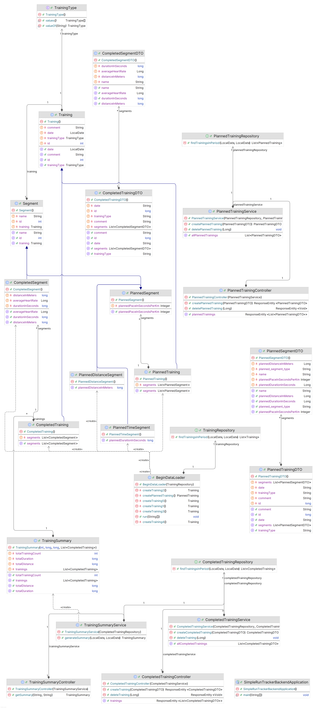

# How to run
## Requirements
- Docker
- Gradle
- JDK 17
- Node.js
- npm
## Process
1. Run this command for starting the postgresql database container
```bash
docker run --name postgres-database  -e POSTGRES_PASSWORD=password -p 5432:5432 -d postgres
```
2. Run backend service using this commands
```bash
cd simple-run-tracker-backend
gradle bootRun
```

3. Run frontend service using this commands
```bash
cd simple-run-tracker-frontend
npm install
npm run dev
```

# Description
Aplikacja Simple Training Tracker umożliwia użytkownikowi zarządzanie treningami oraz generowanie podsumowań z odbytych sesji treningowych. Dzięki kalendarzowi użytkownik może łatwo zobaczyć zaplanowane i zrealizowane treningi, a także dodać nowe treningi do swojego harmonogramu. Sekcja podsumowań pozwala na wygenerowanie raportu z wybranego okresu.

# User interface
- Górny pasek nawigacyjny:
    - Znajduje się na górze każdej strony aplikacji.
    - Zawiera linki do sekcji: "Calendar" i "Summarry
- Strona Główna (Sekcja Calendar)
    - Wyświetla kalendarz oraz listę z odbytymi i planowanymi treningami
    - Kolor zielony reprezentuje odbyty a fioletowy planowany trening
    - Obok kalendarza znajdują się przyciski:
        - "Today", "Back", "Next" do poruszania się po kalendarzu
        - "Add Training" do dodawania odbytych treningów
        - "Add Planned Training" do planowania treningu
    - Obok każdego treningu na liście znajduje przycisk "Details" 
- Szczegóły treningu
    - Po kliknieciu na trening w kalendarzu lub przycisk "Details" w liscie
    - Pokazuje dane typ treningu, kometarz, oraz szczegóły segmentów
- Dodawanie Treningu
    - Po kliknięciu na przycisk "Add Training"
    - Uzytkownik uzupelnia dane treningu
    - Obowiazkowe pola to:
        - Rodzaj treningu
        - data
        - distance w segmentach
        - time w segmentach
- Planowanie Treningu
    - Po kliknięciu na przycisk "Add Planned Training"
    - Uzytkownik uzupelnia parametry planowanego treningu
    - Obowiazkowe pola to:
        - Rodzaj treningu
        - data
        - goal w segmentach
        - value w segmentach, który reprezntuje sekundy lub metry w zaleznosci od wybranego goal 
- Generowanie Podsumowań
    - Po kliknięciu "Summary" w pasku nawigacyjnym
    - Posiada dwa pola z datą reprezentującą zekres, z którego chcemy podsumowanie oraz przycisk "Generate Summary"
    - Po nacisnięciu "Generate Summary" wyświetla je ponizej

# Usage examples
- Dodawanie nowego treningu
    - Wejdź do sekcji kalendarza i kliknij przycisk Add Training.
    - W wyświetlonym formularzu uzpełnij dane, o które prosi.
    - Po uzupełnieniu wszystkich danych kliknij „Zapisz”. Trening pojawi się na kalendarzu oraz na liście.
- Dodawanie planowanego treningu
    - Wejdź do sekcji kalendarza i kliknij przycisk Add Planned Training.
    - W wyświetlonym formularzu uzpełnij dane, o które prosi.
    - Po uzupełnieniu wszystkich danych kliknij „Zapisz”. Planowany Trening pojawi się na kalendarzu oraz na liście. 
- Wyświetlanie szczegółów treningu:
    - Kliknij na dowolny trening w kalendarzu lub wybierz przycisk Details obok treningu na liście.
    - Otworzy się modalne okno z pełnymi szczegółami dotyczącymi wybranego treningu, takimi jak data, rodzaj treningu, notatki itp.
- Generowanie podsumowania:
    - Przejdź do sekcji Podsumowanie klikając odpowiedni link w navbarze.
    - Zaznacz interesujący Cię zakres dat za pomocą pól wyboru daty.
    - Kliknij przycisk Generate Summary. System wygeneruje raport z odbytych treningów w wybranym okresie.

# Patterns
- Service layer - skondensowanie logik biznesowych w jednym miejscu. Ulatwia pozniejsza modyfikacje i zwieksza czytelnosc
    - CompletedTrainingService, PlannedTrainingService, TrainingSummaryService
- Data Mapper - Przeksztalca obiektow na dane do bazy danych(nie musialem tworzyc bazy uzywajac klasycznego sql)
    - Training, CompletedTraining, PlannedTraining
    - Segment, CompletedSegment, PlannedSegment, PlannedDistanceSegment, PlannedTimeSegment
- Identity Field - zeby latwiej wykonywac pozniejsze operacje CRUD
    - Training, CompletedTraining, PlannedTraining
    - Segment, CompletedSegment, PlannedSegment, PlannedDistanceSegment, PlannedTimeSegment
- Foreign Key Mapping - zdefiniowanie relacji potrzebnej przy potrzebie usuniecia treningu
    - Training, Segment
- Single Table Inheritance - trening planowany i wykonany oraz 3 rodzaje segmentow w jednej tabeli
    - Training, CompletedTraining, PlannedTraining
    - Segment, CompletedSegment, PlannedSegment, PlannedDistanceSegment, PlannedTimeSegment
- Repository
    - CompletedTrainingRepository, PlannedTrainingRepository
- Model View Controller
    - Spring: Model and Controller
    - React: View
- Front Controller - automatycznie obslugiwany
    - CompletedTrainingController, PlannedTrainingController, TrainingSummaryController
- Data Transfer Object
    - TrainingSummary
    - CompletedTrainingDTO, CompletedSegmentDTO
    - PlannedTraingDTO, PlannedSegmentDTO
- Mapper
    - CompletedSegmentMapper, CompletedTrainingMapper
    - PlannedSegmentMapper, PlannedTrainingMapper

# Class Diagram


# TODO backend
[x] Make empty project for backend
[x] Set for H2 Database
[x] Create Training entity
[x] Creating basic endpoints for enity
[x] Fill with example data on the begining
[x] Create endpoint which gets summarry
[x] Creating planned traing (Set goal: time or distance) - single table inheritance
[x] Make endpoints for planned training
[x] Switch to normal database
[ ] Remove BeginDataLoader and save data in normal database
[ ] Make mappers

# TODO frontend
[x] Create empty project for frontend in react
[x] Create DTO for completed traing instances
[x] Create Service for get and post training instances
[x] Create page which list all of trainings as list
[x] Create page with calendar view
[x] Add training view into calendar
[x] Add button and modal for creaing new training
[x] Refreshing the calendar with new traing
[x] Clear data from adding modal after leave or save
[x] Create page with data summarry
[x] Add rooting
[x] Create dto for planned traing
[x] Add to Service option of get and post planned traing
[x] Add view for planned traing in calendar
[x] Add button for planned training
[x] Add editing possibility
[ ] Creating notification for nearest traing day before
[x] Add verification of data
[x] Disable verification on comment and average heart rate and planned pace