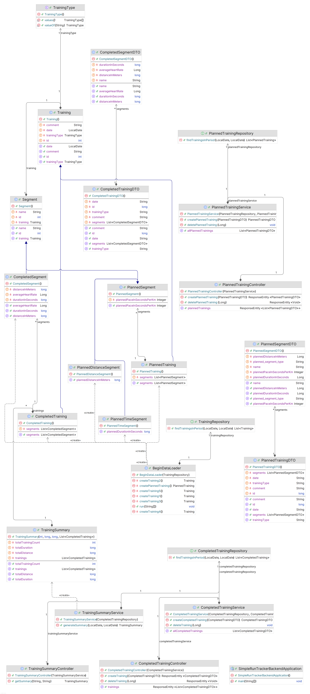

# Jak uruchomić
## Wymagania
- Docker
- Gradle
- JDK 17
- Node.js
- npm
## Proces
1. Uruchom tę komendę, aby uruchomić kontener bazy danych PostgreSQL
```bash
docker run --name postgres-database  -e POSTGRES_PASSWORD=password -p 5432:5432 -d postgres
```
2. Uruchom usługę backendową za pomocą tych komend
```bash
cd simple-run-tracker-backend
gradle bootRun
```

3. Uruchom usługę frontendową za pomocą tych komend
```bash
cd simple-run-tracker-frontend
npm install
npm run dev
```

# Opis
Aplikacja Simple Training Tracker umożliwia użytkownikowi zarządzanie treningami oraz generowanie podsumowań z odbytych sesji treningowych. Dzięki kalendarzowi użytkownik może łatwo zobaczyć zaplanowane i zrealizowane treningi, a także dodać nowe treningi do swojego harmonogramu. Sekcja podsumowań pozwala na wygenerowanie raportu z wybranego okresu.

# Interfejs użytkownika
- Górny pasek nawigacyjny:
    - Znajduje się na górze każdej strony aplikacji.
    - Zawiera linki do sekcji: "Kalendarz" i "Podsumowanie".
- Strona Główna (Sekcja Kalendarz)
    - Wyświetla kalendarz oraz listę z odbytymi i planowanymi treningami.
    - Kolor zielony reprezentuje odbyty, a fioletowy planowany trening.
    - Obok kalendarza znajdują się przyciski:
        - "Dzisiaj", "Wstecz", "Dalej" do poruszania się po kalendarzu.
        - "Dodaj Trening" do dodawania odbytych treningów.
        - "Dodaj Planowany Trening" do planowania treningu.
    - Obok każdego treningu na liście znajduje się przycisk "Szczegóły".
- Szczegóły Treningu
    - Po kliknięciu na trening w kalendarzu lub przycisk "Szczegóły" na liście.
    - Pokazuje dane takie jak typ treningu, komentarz oraz szczegóły segmentów.
- Dodawanie Treningu
    - Po kliknięciu na przycisk "Dodaj Trening".
    - Użytkownik uzupełnia dane treningu.
    - Obowiązkowe pola to:
        - Rodzaj treningu
        - Data
        - Dystans w segmentach
        - Czas w segmentach
- Planowanie Treningu
    - Po kliknięciu na przycisk "Dodaj Planowany Trening".
    - Użytkownik uzupełnia parametry planowanego treningu.
    - Obowiązkowe pola to:
        - Rodzaj treningu
        - Data
        - Cel w segmentach
        - Wartość w segmentach, która reprezentuje sekundy lub metry w zależności od wybranego celu.
- Generowanie Podsumowań
    - Po kliknięciu "Podsumowanie" w pasku nawigacyjnym.
    - Posiada dwa pola z datą reprezentującą zakres, z którego chcemy podsumowanie oraz przycisk "Generuj Podsumowanie".
    - Po naciśnięciu "Generuj Podsumowanie" wyświetla je poniżej.

# Przykłady użycia
- Dodawanie nowego treningu
    - Wejdź do sekcji kalendarza i kliknij przycisk Dodaj Trening.
    - W wyświetlonym formularzu uzupełnij dane, o które prosi.
    - Po uzupełnieniu wszystkich danych kliknij "Zapisz". Trening pojawi się na kalendarzu oraz na liście.
- Dodawanie planowanego treningu
    - Wejdź do sekcji kalendarza i kliknij przycisk Dodaj Planowany Trening.
    - W wyświetlonym formularzu uzupełnij dane, o które prosi.
    - Po uzupełnieniu wszystkich danych kliknij "Zapisz". Planowany trening pojawi się na kalendarzu oraz na liście.
- Wyświetlanie szczegółów treningu:
    - Kliknij na dowolny trening w kalendarzu lub wybierz przycisk Szczegóły obok treningu na liście.
    - Otworzy się okno modalne z pełnymi szczegółami dotyczącymi wybranego treningu, takimi jak data, rodzaj treningu, notatki itp.
- Generowanie podsumowania:
    - Przejdź do sekcji Podsumowanie klikając odpowiedni link w navbarze.
    - Zaznacz interesujący Cię zakres dat za pomocą pól wyboru daty.
    - Kliknij przycisk Generuj Podsumowanie. System wygeneruje raport z odbytych treningów w wybranym okresie.

# Patterns
- Service layer
    - CompletedTrainingService, PlannedTrainingService, TrainingSummaryService
    - dlaczego jest używana: Aby skonsolidować logikę biznesową w jednym miejscu dla łatwiejszej modyfikacji i czytelności.
- Data Mapper
    - Training, CompletedTraining, PlannedTraining
    - Segment, CompletedSegment, PlannedSegment, PlannedDistanceSegment, PlannedTimeSegment
    - dlaczego jest używana: Aby przekształcać obiekty w dane bazy danych bez użycia tradycyjnego SQL.
- Identity Field
    - Training, CompletedTraining, PlannedTraining
    - Segment, CompletedSegment, PlannedSegment, PlannedDistanceSegment, PlannedTimeSegment
    - dlaczego jest używana: Aby uprościć późniejsze operacje CRUD.
- Foreign Key Mapping
    - Training, Segment
    - dlaczego jest używana: Aby zdefiniować relacje między encjami dla łatwiejszej manipulacji danymi.
- Single Table Inheritance
    - Training, CompletedTraining, PlannedTraining
    - Segment, CompletedSegment, PlannedSegment, PlannedDistanceSegment, PlannedTimeSegment
    - dlaczego jest używana: Aby przechowywać różne typy powiązanych encji w jednej tabeli.
- Repository
    - CompletedTrainingRepository, PlannedTrainingRepository
    - dlaczego jest używana: Aby abstrakcyjnie uzyskać dostęp do danych i zapewnić scentralizowany mechanizm obsługi danych.
- Model View Controller
    - Spring: Model i Kontroler
    - React: Widok
    - dlaczego jest używana: Aby oddzielić obawy i poprawić utrzymanie kodu.
- Front Controller - automatycznie obsługiwany
    - CompletedTrainingController, PlannedTrainingController, TrainingSummaryController
    - dlaczego jest używana: Aby obsługiwać wszystkie przychodzące żądania przez jeden punkt wejścia.
- Data Transfer Object
    - TrainingSummary
    - CompletedTrainingDTO, CompletedSegmentDTO
    - PlannedTrainingDTO, PlannedSegmentDTO
    - dlaczego jest używana: Aby przenosić dane między warstwami bez ujawniania podstawowych encji.
- Mapper
    - CompletedSegmentMapper, CompletedTrainingMapper
    - PlannedSegmentMapper, PlannedTrainingMapper
    - dlaczego jest używana: Aby konwertować między DTO a encjami.

# Diagram klas


# TODO backend
[x] Utwórz pusty projekt dla backendu
[x] Skonfiguruj bazę danych H2
[x] Utwórz encję Training
[x] Tworzenie podstawowych punktów końcowych dla encji
[x] Wypełnij przykładowymi danymi na początku
[x] Utwórz punkt końcowy, który pobiera podsumowanie
[x] Tworzenie planowanego treningu (Ustaw cel: czas lub dystans) - dziedziczenie pojedynczej tabeli
[x] Utwórz punkty końcowe dla planowanego treningu
[x] Przełącz na normalną bazę danych
[ ] Usuń BeginDataLoader i zapisz dane w normalnej bazie danych
[ ] Utwórz mapery

# TODO frontend
[x] Utwórz pusty projekt dla frontend w react
[x] Utwórz DTO dla ukończonych instancji treningowych
[x] Utwórz serwis do pobierania i wysyłania instancji treningowych
[x] Utwórz stronę, która wyświetla wszystkie treningi jako listę
[x] Utwórz stronę z widokiem kalendarza
[x] Dodaj widok treningu do kalendarza
[x] Dodaj przycisk i modal do tworzenia nowego treningu
[x] Odśwież kalendarz nowym treningiem
[x] Wyczyść dane z modalu dodawania po opuszczeniu lub zapisaniu
[x] Utwórz stronę z podsumowaniem danych
[x] Dodaj routing
[x] Utwórz dto dla planowanego treningu
[x] Dodaj do serwisu opcję pobierania i wysyłania planowanego treningu
[x] Dodaj widok planowanego treningu w kalendarzu
[x] Dodaj przycisk do planowanego treningu
[x] Dodaj możliwość edycji
[ ] Tworzenie powiadomienia na dzień przed najbliższym treningiem
[x] Dodaj weryfikację danych
[x] Wyłącz weryfikację na komentarz i średnie tętno oraz planowane tempo